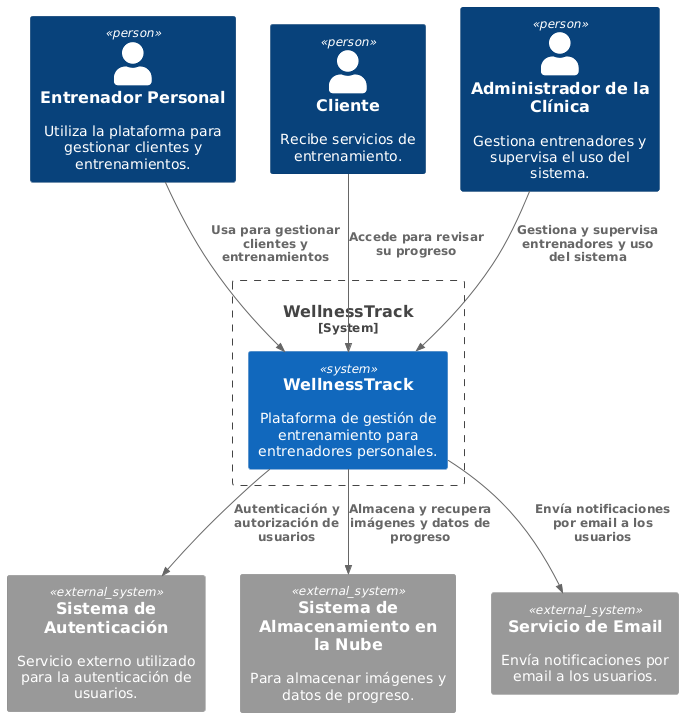
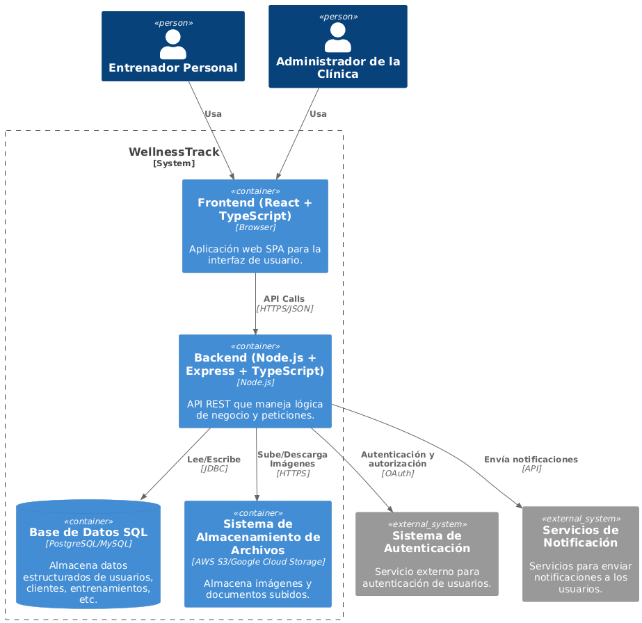
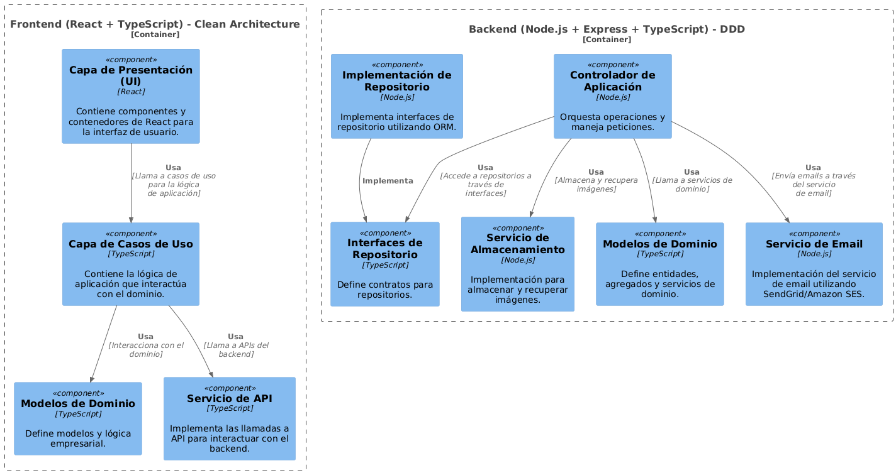
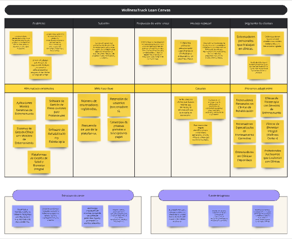
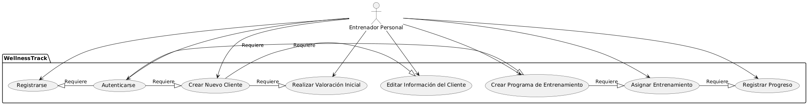
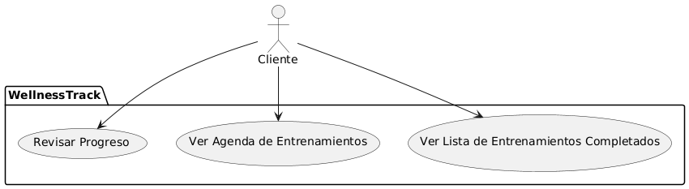
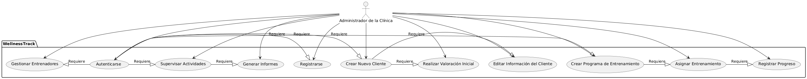
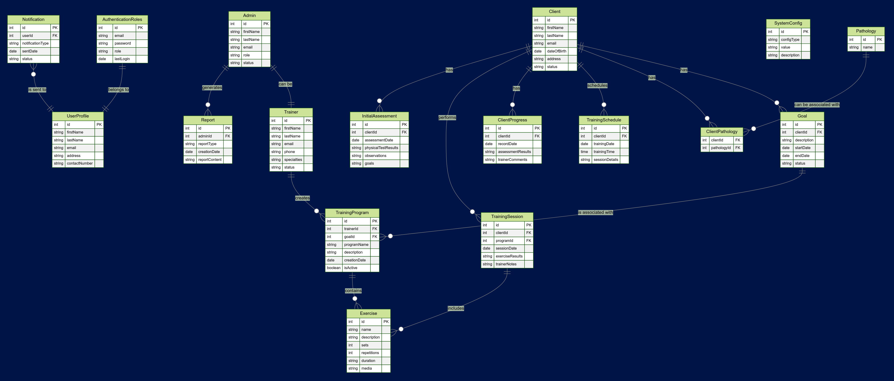

## Índice

0. [Ficha del proyecto](#0-ficha-del-proyecto)
1. [Descripción general del producto](#1-descripción-general-del-producto)
2. [Arquitectura del sistema](#2-arquitectura-del-sistema)
3. [Modelo de datos](#3-modelo-de-datos)
4. [Especificación de la API](#4-especificación-de-la-api)
5. [Historias de usuario](#5-historias-de-usuario)
6. [Tickets de trabajo](#6-tickets-de-trabajo)
7. [Pull requests](#7-pull-requests)

---

## 0. Ficha del proyecto

### **0.1. Tu nombre completo:** Nacho Viano Martinez

### **0.2. Nombre del proyecto:** WellnessTrack

### **0.3. Descripción breve del proyecto:** Un sistema completo de gestión para entrenadores en clínicas, que permite personalizar evaluaciones iniciales, asignar ejercicios y hacer un seguimiento detallado del progreso de los clientes, todo en una plataforma fácil de usar.

### **0.4. URL del proyecto:** https://github.com/Nviano/AI4Devs-finalproject

> Puede ser pública o privada, en cuyo caso deberás compartir los accesos de manera segura. Puedes enviarlos a [alvaro@lidr.co](mailto:alvaro@lidr.co) usando algún servicio como [onetimesecret](https://onetimesecret.com/).

### 0.5. URL o archivo comprimido del repositorio

> Puedes tenerlo alojado en público o en privado, en cuyo caso deberás compartir los accesos de manera segura. Puedes enviarlos a [alvaro@lidr.co](mailto:alvaro@lidr.co) usando algún servicio como [onetimesecret](https://onetimesecret.com/). También puedes compartir por correo un archivo zip con el contenido

---

## 1. Descripción general del producto

### **1.1. Objetivo:**

**Propósito del producto:**
El objetivo principal de esta web app es proporcionar a los entrenadores personales de una clínica una herramienta eficiente y personalizable para gestionar y monitorizar a sus clientes (pacientes). La aplicación busca optimizar la organización de los entrenadores, facilitar la personalización de entrenamientos y valoraciones iniciales, y asegurar un seguimiento detallado del progreso de cada cliente.

**Qué valor aporta:**

- **Eficiencia y organización:** Los entrenadores pueden manejar de forma centralizada toda la información relevante de sus clientes, lo que ahorra tiempo y reduce la posibilidad de errores.
- **Personalización:** La capacidad de personalizar formularios de valoración inicial y crear ejercicios a medida permite a los entrenadores adaptar los entrenamientos a las necesidades específicas de cada cliente.
- **Seguimiento detallado:** Al registrar los resultados de las sesiones, los entrenadores pueden realizar un seguimiento del progreso de cada cliente, facilitando la toma de decisiones informadas para futuros entrenamientos.

**Qué soluciona:**

- **Gestión de información dispersa:** En lugar de utilizar múltiples herramientas o documentos para gestionar la información de los clientes, los entrenadores tienen todo en un solo lugar.
- **Falta de personalización:** Las aplicaciones genéricas de entrenamiento no siempre permiten la personalización necesaria para clientes con necesidades y patologías específicas.
- **Seguimiento ineficaz:** Sin una herramienta que registre y compare datos de rendimiento y progreso, los entrenadores pueden perder oportunidades para ajustar los entrenamientos de manera óptima.

**Para quién:**

- **Entrenadores personales de la clínica:** Que buscan una herramienta para organizar, personalizar y mejorar la calidad de sus servicios.
- **Clientes de los entrenadores:** Que se benefician de un entrenamiento más personalizado y un seguimiento más detallado de su progreso.

### **1.2. Características y funcionalidades principales:**

1. **Gestión de Usuarios:**

   - **Registro de profesionales:** Los profesionales pueden registrarse en la plataforma para obtener acceso a sus funcionalidades personalizadas.
   - **Creación y gestión de clientes:** Los entrenadores pueden dar de alta a nuevos clientes, registrar detalles importantes y gestionar sus perfiles.

2. **Valoración Inicial:**

   - **Formularios personalizables:** Cada profesional puede crear y modificar formularios de valoración inicial para capturar la información relevante según las necesidades del cliente.
   - **Registro de resultados de pruebas físicas:** Los entrenadores pueden registrar resultados de pruebas de movilidad y otros tests específicos, incluyendo la posibilidad de subir imágenes para documentar posturas o condiciones iniciales.

3. **Gestión de Ejercicios y Sesiones:**

   - **Creación de ejercicios personalizados:** Los entrenadores pueden crear ejercicios con detalles específicos como series, repeticiones, tiempo, y subir imágenes descriptivas.
   - **Asignación de ejercicios a clientes:** Los ejercicios creados pueden ser asignados a los clientes de acuerdo a sus necesidades y objetivos.
   - **Documentación de sesiones:** Cada sesión puede ser comentada por el entrenador para tener un historial de cómo fue la sesión, qué se logró, y qué ajustar en el futuro.

4. **Comparación de Imágenes:**

   - **Visualización de progreso:** Utilizando una librería de React, los entrenadores pueden comparar imágenes de las pruebas de movilidad o ejercicios para ver el progreso del cliente a lo largo del tiempo.

5. **Calendario de Citas (Versión Básica):**
   - **Gestión de citas:** Los entrenadores pueden crear y eliminar citas en un calendario interno para organizar su agenda.

### **1.3. Diseño y experiencia de usuario:**

> Proporciona imágenes y/o videotutorial mostrando la experiencia del usuario desde que aterriza en la aplicación, pasando por todas las funcionalidades principales.

### **1.4. Instrucciones de instalación:**

> Documenta de manera precisa las instrucciones para instalar y poner en marcha el proyecto en local (librerías, backend, frontend, servidor, base de datos, migraciones y semillas de datos, etc.)

---

## 2. Arquitectura del Sistema

### **2.1. Diagrama de arquitectura:**

#### 2.1.1 Diagrama de Contexto

El diagrama de contexto proporciona una visión general de **WellnessTrack** en su entorno operativo, mostrando los principales actores que interactúan con el sistema y otros sistemas externos con los que se comunica.

- **Actores:**

  - **Entrenador Personal:** Usuario principal que utiliza la plataforma para gestionar clientes y entrenamientos.
  - **Cliente:** Usuario final que recibe servicios de entrenamiento (en versiones futuras, podría tener acceso limitado a la plataforma para revisar su progreso).
  - **Administrador de la Clínica:** Usuario que gestiona múltiples entrenadores y puede supervisar el uso del sistema.

- **Sistema Principal:**

  - **WellnessTrack:** Plataforma de gestión de entrenamiento para entrenadores personales en entornos clínicos.

- **Sistemas Externos:**
  - **Sistema de Autenticación (OAuth):** Servicio externo utilizado para la autenticación de usuarios (por ejemplo, Google OAuth, Auth0).
  - **Sistema de Almacenamiento en la Nube:** Para almacenar imágenes y datos de progreso (por ejemplo, AWS S3, Google Cloud Storage).
  - **Servicios de Email:** Servicios de terceros para enviar notificaciones a los usuarios (por ejemplo, SendGrid, Amazon SES).



#### 2.1.2 Diagrama de Contenedores

El diagrama de contenedores muestra los diferentes contenedores dentro del sistema **WellnessTrack**, como aplicaciones frontend, servicios backend y bases de datos, y cómo se comunican entre sí.

- **Frontend (React + TypeScript):**

  - Aplicación web SPA que proporciona la interfaz de usuario para entrenadores personales y administradores.
  - Consume APIs del backend para la gestión de usuarios, clientes, entrenamientos, y citas.

- **Backend (Node.js + Express + TypeScript):**
  - **Servicio de API REST:** Maneja todas las peticiones del frontend, incluyendo autenticación, gestión de usuarios, y lógica de negocio.
  - **Microservicio de Procesamiento de Imágenes:** (Opcional, para escalabilidad futura) Para redimensionar y almacenar imágenes subidas por los entrenadores.
- **Base de Datos SQL (PostgreSQL/MySQL):**

  - Almacena toda la información estructurada, incluyendo datos de usuarios, clientes, entrenamientos, formularios personalizados, y citas.

- **Sistema de Almacenamiento de Archivos (AWS S3, Google Cloud Storage):**
  - Almacena imágenes y documentos subidos por los entrenadores para seguimiento de progreso.



#### 2.1.3 Diagrama de Componentes

El diagrama de componentes desglosa el sistema **WellnessTrack** en sus componentes internos y muestra cómo interactúan entre sí.

##### **Frontend (React + TypeScript) - Clean Architecture:**

1. **Capa de Presentación (UI):**
   - Contiene componentes React que manejan la interfaz de usuario y las interacciones.
2. **Capa de Casos de Uso:**
   - Gestiona la lógica de la aplicación y coordina las interacciones entre la UI y la capa de dominio.
3. **Modelos de Dominio:**

   - Define los modelos de negocio y la lógica empresarial del frontend.

4. **Servicio de API:**
   - Implementa las llamadas API para interactuar con el backend.

##### **Backend (Node.js + Express + TypeScript) - DDD:**

1. **Controlador de Aplicación:**

   - Maneja las peticiones del frontend y orquesta operaciones en el backend.

2. **Modelos de Dominio:**

   - Define las entidades, agregados y servicios de dominio según el diseño DDD.

3. **Interfaces de Repositorio:**

   - Define contratos para los repositorios, facilitando la separación de la lógica del dominio de la infraestructura.

4. **Implementación de Repositorio:**

   - Proporciona las implementaciones concretas de las interfaces de repositorio utilizando ORM (Object-Relational Mapping).

5. **Servicio de Email:**

   - Implementa la funcionalidad para enviar correos electrónicos utilizando servicios como SendGrid o Amazon SES.

6. **Servicio de Almacenamiento:**
   - Maneja la funcionalidad para almacenar y recuperar imágenes en la nube.



#### 2.1.4 Justificación de la Arquitectura y Patrones Predefinidos

### Patrones Arquitectónicos Utilizados

En **WellnessTrack** hemos optado por seguir dos patrones arquitectónicos predefinidos:

1. **Domain-Driven Design (DDD) para el Backend:**
   - **Descripción:** DDD es una técnica de diseño de software que se enfoca en el dominio del problema y en la creación de modelos de dominio ricos que representan los conceptos del negocio. En nuestro caso, esto se traduce en una clara separación de responsabilidades dentro del backend, donde las entidades de dominio y la lógica empresarial se separan de la infraestructura y los detalles de implementación.
2. **Clean Architecture para el Frontend:**
   - **Descripción:** Clean Architecture es un enfoque que busca separar los detalles de la implementación (como frameworks y bases de datos) de la lógica de negocio, proporcionando independencia de la UI y del framework. Esto resulta en un código más mantenible, testeable y flexible ante cambios.

### Justificación de la Elección de la Arquitectura

#### **Por qué DDD en el Backend:**

- **Enfoque en el Dominio del Problema:** DDD ayuda a centrarse en los problemas específicos del negocio, lo que permite que la solución software esté alineada con las necesidades reales de los entrenadores personales y de las clínicas.
- **Separación de Responsabilidades:** DDD proporciona una estructura clara que separa la lógica de negocio de los detalles técnicos, lo cual facilita la gestión y evolución del código a medida que cambian los requisitos del negocio.
- **Escalabilidad y Flexibilidad:** Con DDD, el sistema está preparado para escalar y adaptarse fácilmente a nuevas características y cambios en el negocio sin comprometer la integridad del modelo de dominio.

#### **Por qué Clean Architecture en el Frontend:**

- **Independencia de Framework:** Al separar la lógica de la aplicación del framework React, es más fácil cambiar tecnologías o actualizar versiones de manera independiente.
- **Mantenibilidad:** Clean Architecture facilita la escritura de código modular y testable, lo que reduce el esfuerzo de mantenimiento a lo largo del tiempo.
- **Facilidad de Testeo:** Al mantener las dependencias externas en capas separadas, se pueden realizar pruebas unitarias más efectivas en la lógica de negocio sin necesidad de configurar toda la aplicación.

### Beneficios Principales

1. **Modularidad:** Ambas arquitecturas promueven un código modular que facilita la comprensión, mantenimiento y evolución del sistema.
2. **Flexibilidad:** Permiten cambiar o actualizar componentes individuales sin afectar significativamente otras partes del sistema.
3. **Escalabilidad:** La separación de preocupaciones facilita escalar la aplicación de manera más segura y controlada.
4. **Mantenibilidad:** Un diseño bien organizado reduce los costos de mantenimiento a largo plazo y facilita la incorporación de nuevas funcionalidades.

### Sacrificios o Déficits

1. **Curva de Aprendizaje:** Implementar DDD y Clean Architecture puede ser complejo para desarrolladores sin experiencia previa en estas arquitecturas, lo que puede aumentar el tiempo de desarrollo inicial.
2. **Sobreingeniería:** Para proyectos pequeños o MVPs simples, estas arquitecturas pueden parecer excesivas y agregar complejidad innecesaria.
3. **Tiempo de Configuración:** La configuración inicial para establecer las capas y estructuras necesarias puede ser mayor en comparación con un enfoque más monolítico o tradicional.

### **2.2. Descripción de componentes principales:**

### Frontend (React + TypeScript) - Clean Architecture

- **Capa de Presentación (UI):**

  - **Descripción:** Componentes de React que manejan la interfaz de usuario y las interacciones del usuario con la aplicación.
  - **Funcionalidades clave:** Renderizado de páginas, manejo de eventos de usuario, actualización dinámica de la UI.

- **Capa de Casos de Uso:**

  - **Descripción:** Contiene la lógica de aplicación que interactúa con el dominio.
  - **Funcionalidades clave:** Orquestación de flujos de trabajo, validación de reglas de negocio, interacción con APIs.

- **Modelos de Dominio:**

  - **Descripción:** Define los modelos de negocio y la lógica empresarial del frontend.
  - **Funcionalidades clave:** Representación de entidades de negocio, manejo de estados de la aplicación.

- **Servicio de API:**
  - **Descripción:** Implementa las llamadas a API para interactuar con el backend.
  - **Funcionalidades clave:** Realización de peticiones HTTP, manejo de respuestas y errores.

### Backend (Node.js + Express + TypeScript) - DDD

- **Controlador de Aplicación:**

  - **Descripción:** Orquesta operaciones y maneja peticiones del frontend.
  - **Funcionalidades clave:** Procesamiento de solicitudes HTTP, delegación de lógica a servicios de dominio.

- **Modelos de Dominio:**

  - **Descripción:** Define las entidades, agregados y servicios de dominio siguiendo el diseño DDD.
  - **Funcionalidades clave:** Representación de reglas de negocio, mantenimiento de integridad del dominio.

- **Interfaces de Repositorio:**

  - **Descripción:** Define contratos para los repositorios.
  - **Funcionalidades clave:** Abstracción del acceso a datos, definición de métodos CRUD.

- **Implementación de Repositorio:**

  - **Descripción:** Implementa las interfaces de repositorio utilizando ORM.
  - **Funcionalidades clave:** Comunicación con la base de datos, ejecución de operaciones CRUD.

- **Servicio de Email:**

  - **Descripción:** Implementa la funcionalidad para enviar correos electrónicos utilizando servicios externos.
  - **Funcionalidades clave:** Envío de notificaciones y recordatorios por email.

- **Servicio de Almacenamiento:**
  - **Descripción:** Maneja la funcionalidad para almacenar y recuperar imágenes en la nube.
  - **Funcionalidades clave:** Gestión de archivos, integración con servicios de almacenamiento en la nube.

---

## **Diagrama Lean Canvas**

El **Lean Canvas** es una herramienta que se ha utilizado para definir el modelo de negocio de **WellnessTrack**, enfocándose en los aspectos clave como el problema, la solución, la propuesta de valor única, los segmentos de clientes, y más.



- **Problema:**

  - Los entrenadores personales necesitan una herramienta eficiente para gestionar a sus clientes en clínicas, especialmente aquellos con patologías específicas.
  - Las aplicaciones genéricas de entrenamiento no permiten la personalización necesaria para adaptar los entrenamientos y valoraciones a las necesidades individuales de los clientes.
  - Existen dificultades para realizar un seguimiento detallado y documentar adecuadamente el progreso de los clientes a lo largo del tiempo.

- **Segmento de Clientes:**

  - Entrenadores personales que trabajan en clínicas.
  - Clínicas que desean ofrecer un valor añadido a sus servicios mediante el uso de herramientas digitales.
  - Clientes de entrenadores (potencial para futuro), que podrían beneficiarse de un seguimiento más detallado y personalizado de su progreso.

- **Propuesta de Valor Única:**

  - WellnessTrack es una plataforma web personalizada que permite a los entrenadores personales gestionar eficientemente a sus clientes, crear entrenamientos personalizados y realizar un seguimiento detallado del progreso de cada cliente, todo en un solo lugar.

- **Solución:**

  - Una plataforma web que permite la creación de perfiles de clientes, personalización de formularios de valoración inicial, asignación de ejercicios y sesiones, y documentación del progreso a través de imágenes y comentarios.

- **Ventaja Especial:**

  - Plataforma altamente personalizable específicamente diseñada para entrenadores en entornos clínicos.
  - Integración de funcionalidades únicas, como la comparación de imágenes y la personalización de formularios, que no están disponibles en otras aplicaciones de entrenamiento, proporcionando un valor añadido difícil de replicar.

- **Canales:**

  - Venta directa a clínicas que buscan mejorar sus servicios y la eficiencia de sus entrenadores personales.
  - Asociaciones con organizaciones de entrenamiento o certificación de entrenadores personales para aumentar la visibilidad y credibilidad de la plataforma.
  - Publicidad online dirigida específicamente a entrenadores personales y clínicas, utilizando estrategias de marketing digital.

- **Métricas Clave:**

  - Número de entrenadores registrados.
  - Retención de usuarios (entrenadores).
  - Frecuencia de uso de la plataforma.
  - Conversión de pruebas gratuitas a suscripciones pagas.

- **Estructura de Costos:**

  - Desarrollo y mantenimiento de software, incluyendo actualizaciones y mejoras continuas de la plataforma.
  - Costos de servidores y almacenamiento en la nube para asegurar un servicio rápido y seguro para todos los usuarios.
  - Marketing y adquisición de usuarios, incluyendo campañas de publicidad digital y promoción en eventos relevantes.
  - Soporte al cliente y actualizaciones de software, proporcionando un servicio de atención al cliente eficaz y actualizaciones periódicas de la plataforma.

- **Fuentes de Ingresos:**

  - Suscripción mensual o anual por entrenador, ofreciendo un modelo de precios escalonado basado en la cantidad de usuarios.
  - Licencias de uso para clínicas con múltiples entrenadores, proporcionando descuentos por volumen y características adicionales.
  - Versiones premium con funcionalidades avanzadas, como informes detallados y análisis de progreso, o integración con herramientas externas como Google Calendar.

  ## **Casos de uso principales**

  En esta sección se describen los casos de uso principales de **WellnessTrack**, detallando cómo interactúan los diferentes actores con el sistema y qué acciones pueden realizar. Se incluirán imágenes para ilustrar los casos de uso de cada actor.

### Caso de Uso 1: Gestión de Clientes por Entrenadores Personales

**Descripción:** Este caso de uso se centra en cómo los entrenadores personales gestionan a sus clientes en **WellnessTrack**. Incluye la creación de nuevos clientes, la realización de valoraciones iniciales, la edición de la información del cliente y la administración de los perfiles de los clientes.

**Roles Involucrados:**

- **Entrenador Personal:** Usuario principal que utiliza la plataforma para gestionar clientes y entrenamientos.

**Acciones del Entrenador Personal:**

1. **Registrarse en la Plataforma:** El entrenador crea una cuenta en la plataforma proporcionando su información personal y profesional.
2. **Autenticarse en el Sistema:** Inicia sesión utilizando sus credenciales (email y contraseña).
3. **Crear un Nuevo Cliente:** Añade un nuevo cliente a su lista, introduciendo datos como nombre, edad, condiciones médicas y objetivos de entrenamiento.
4. **Realizar una Valoración Inicial:** Completa un formulario de evaluación inicial para registrar la condición física y objetivos del cliente.
5. **Editar Información del Cliente:** Actualiza la información del cliente existente, incluyendo su progreso, notas adicionales o cambios en sus objetivos.

**Imagen de Caso de Uso del Entrenador Personal:**



---

### Caso de Uso 2: Asignación y Seguimiento de Entrenamientos Personalizados

**Descripción:** Este caso de uso describe cómo los entrenadores personales asignan programas de entrenamiento personalizados a los clientes y realizan un seguimiento del progreso de los mismos. Incluye la creación de programas de entrenamiento, la asignación de estos a clientes y el registro de los resultados de cada sesión.

**Roles Involucrados:**

- **Entrenador Personal:** Usuario que personaliza los entrenamientos para cada cliente basado en sus necesidades y objetivos.

**Acciones del Entrenador Personal:**

1. **Crear un Programa de Entrenamiento Personalizado:** Define un conjunto de ejercicios específicos, incluyendo repeticiones, series y tiempos, adaptados a las necesidades del cliente.
2. **Asignar Entrenamientos a Clientes:** Asigna los programas de entrenamiento creados a uno o más clientes.
3. **Registrar Progreso de Entrenamiento:** Documenta el progreso del cliente, como el peso alcanzado, repeticiones completadas o cualquier ajuste necesario en el programa.

**Imagen de Caso de Uso del Entrenador Personal:**


---

### Caso de Uso 3: Interacción del Cliente con la Plataforma

**Descripción:** Este caso de uso se enfoca en cómo los clientes interactúan con la plataforma **WellnessTrack** para revisar su progreso, ver la agenda de entrenamientos y consultar la lista de entrenamientos completados.

**Roles Involucrados:**

- **Cliente:** Usuario final que recibe servicios de entrenamiento y utiliza la plataforma para seguir su progreso y agenda de entrenamientos.

**Acciones del Cliente:**

1. **Revisar Progreso:** Ver el progreso acumulado en términos de métricas de entrenamiento, registros de rendimiento y mejoras generales.
2. **Ver Agenda de Entrenamientos:** Consultar su agenda para ver cuándo están programados los próximos entrenamientos.
3. **Ver Lista de Entrenamientos Completados:** Revisar los entrenamientos que ha realizado hasta la fecha de consulta, incluyendo detalles sobre cada sesión.

**Imagen de Caso de Uso del Cliente:**



---

###Caso de Uso 4: Gestión y Administración del Sistema por el Administrador de la Clínica

**Descripción:** Este caso de uso se enfoca en cómo el administrador de la clínica gestiona el sistema, incluyendo la administración de entrenadores y la supervisión del uso del sistema. Además, se describe cómo un administrador que también es entrenador puede realizar funciones de ambos roles.

**Roles Involucrados:**

- **Administrador de la Clínica:** Usuario que gestiona múltiples entrenadores y supervisa el uso del sistema.
- **Entrenador Personal:** En algunos casos, el administrador también puede actuar como entrenador personal.

**Acciones del Administrador de la Clínica:**

1. **Autenticarse en el Sistema:** Inicia sesión utilizando sus credenciales.
2. **Gestionar Entrenadores Personales:** Añade o elimina entrenadores de la plataforma y asigna permisos específicos.
3. **Supervisar Actividades y Generar Informes:** Visualiza informes y estadísticas sobre la actividad de los entrenadores y el progreso de los clientes.

**Acciones del Entrenador Personal (cuando el administrador también es entrenador):**

1. **Registrar Nuevo Cliente:** Añade nuevos clientes a la plataforma y gestiona su información.
2. **Asignar y Administrar Entrenamientos:** Crea y asigna programas de entrenamiento personalizados a los clientes.
3. **Registrar Progreso de Clientes:** Documenta el progreso de los clientes y ajusta los entrenamientos según sea necesario.

**Imagen de Caso de Uso del Administrador de la Clínica:**



### **2.3. Descripción de alto nivel del proyecto y estructura de ficheros**

> Representa la estructura del proyecto y explica brevemente el propósito de las carpetas principales, así como si obedece a algún patrón o arquitectura específica.

### **2.4. Infraestructura y despliegue**

> Detalla la infraestructura del proyecto, incluyendo un diagrama en el formato que creas conveniente, y explica el proceso de despliegue que se sigue

### **2.5. Seguridad**

> Enumera y describe las prácticas de seguridad principales que se han implementado en el proyecto, añadiendo ejemplos si procede

### **2.6. Tests**

> Describe brevemente algunos de los tests realizados

---

## 3. Modelo de Datos

### **3.1. Diagrama del modelo de datos:**

El modelo de datos de **WellnessTrack** se ha diseñado para capturar todas las interacciones y datos relevantes que se manejan en la plataforma. A continuación, se presenta el diagrama del modelo de datos que muestra las entidades principales y sus relaciones.



### **3.2. Descripción de entidades principales:**

### **Trainer (Entrenador)**

- **Descripción:** Representa a los entrenadores personales registrados en el sistema que gestionan clientes y entrenamientos.
- **Atributos:**
  - `id` (int, PK, not null): Identificador único del entrenador.
  - `firstName` (string, not null): Nombre del entrenador.
  - `lastName` (string, not null): Apellido del entrenador.
  - `email` (string, not null, unique): Correo electrónico del entrenador.
  - `phone` (string): Número de teléfono del entrenador.
  - `specialties` (string): Especialidades del entrenador.
  - `status` (string, not null): Estado del entrenador (Activo/Inactivo).
- **Relaciones:**
  - Un entrenador puede crear múltiples **TrainingProgram** (Programas de Entrenamiento).

### **Client (Cliente)**

- **Descripción:** Representa a los usuarios finales que reciben servicios de entrenamiento personalizados.
- **Atributos:**
  - `id` (int, PK, not null): Identificador único del cliente.
  - `firstName` (string, not null): Nombre del cliente.
  - `lastName` (string, not null): Apellido del cliente.
  - `email` (string, not null, unique): Correo electrónico del cliente.
  - `dateOfBirth` (date): Fecha de nacimiento del cliente.
  - `address` (string): Dirección del cliente.
  - `status` (string, not null): Estado del cliente (Activo/Inactivo).
- **Relaciones:**
  - Un cliente puede tener múltiples **InitialAssessment** (Valoraciones Iniciales).
  - Un cliente puede realizar múltiples **TrainingSession** (Sesiones de Entrenamiento).
  - Un cliente puede tener múltiples **ClientProgress** (Progresos del Cliente).
  - Un cliente puede tener múltiples **TrainingSchedule** (Agendas de Entrenamientos).
  - Un cliente puede tener múltiples **ClientPathology** (Relaciones de Patologías).
  - Un cliente puede tener múltiples **Goal** (Objetivos).

### **Pathology (Patología)**

- **Descripción:** Representa una patología específica que puede tener un cliente.
- **Atributos:**
  - `id` (int, PK, not null): Identificador único de la patología.
  - `name` (string, not null): Nombre de la patología.
- **Relaciones:**
  - Una patología puede estar asociada a múltiples **ClientPathology** (Relaciones de Patologías).

### **ClientPathology (Relación Cliente-Patología)**

- **Descripción:** Representa la relación entre un cliente y una patología.
- **Atributos:**
  - `clientId` (int, PK, FK, not null): Identificador del cliente asociado.
  - `pathologyId` (int, PK, FK, not null): Identificador de la patología asociada.
- **Relaciones:**
  - Una relación de cliente-patología pertenece a un solo **Client** (Cliente) y una sola **Pathology** (Patología).

### **Goal (Objetivo)**

- **Descripción:** Representa un objetivo específico que un cliente puede tener, como perder peso o entrenar para una maratón.
- **Atributos:**
  - `id` (int, PK, not null): Identificador único del objetivo.
  - `clientId` (int, FK, not null): Identificador del cliente asociado.
  - `description` (string, not null): Descripción del objetivo.
  - `startDate` (date, not null): Fecha de inicio del objetivo.
  - `endDate` (date): Fecha de finalización del objetivo.
  - `status` (string, not null): Estado del objetivo (Activo/Completado).
- **Relaciones:**
  - Un objetivo está asociado a un solo **Client** (Cliente).
  - Un objetivo puede tener múltiples **TrainingProgram** (Programas de Entrenamiento) asociados.

### **TrainingProgram (Programa de Entrenamiento)**

- **Descripción:** Define un conjunto de ejercicios y rutinas personalizadas creadas por los entrenadores para los clientes.
- **Atributos:**
  - `id` (int, PK, not null): Identificador único del programa de entrenamiento.
  - `trainerId` (int, FK, not null): Identificador del entrenador que creó el programa.
  - `goalId` (int, FK): Identificador del objetivo asociado.
  - `programName` (string, not null): Nombre del programa de entrenamiento.
  - `description` (string): Descripción del programa.
  - `creationDate` (date, not null): Fecha de creación del programa.
  - `isActive` (boolean, not null): Estado del programa (Activo/Inactivo).
- **Relaciones:**
  - Un programa de entrenamiento puede contener múltiples **Exercise** (Ejercicios).
  - Un programa de entrenamiento puede estar asociado a un **Goal** (Objetivo).

### **Exercise (Ejercicio)**

- **Descripción:** Contiene detalles específicos sobre los ejercicios individuales, como nombre, descripción, número de series, repeticiones y tiempo.
- **Atributos:**
  - `id` (int, PK, not null): Identificador único del ejercicio.
  - `name` (string, not null): Nombre del ejercicio.
  - `description` (string): Descripción del ejercicio.
  - `sets` (int, not null): Número de series del ejercicio.
  - `repetitions` (int, not null): Número de repeticiones del ejercicio.
  - `duration` (string): Duración del ejercicio.
  - `media` (string): Imagen o video del ejercicio.
- **Relaciones:**
  - Un ejercicio puede estar contenido en múltiples **TrainingProgram** (Programas de Entrenamiento).
  - Un ejercicio puede ser incluido en múltiples **TrainingSession** (Sesiones de Entrenamiento).

### **TrainingSession (Sesión de Entrenamiento)**

- **Descripción:** Registra las sesiones individuales de entrenamiento de un cliente, incluyendo fecha, ejercicios realizados y resultados.
- **Atributos:**
  - `id` (int, PK, not null): Identificador único de la sesión de entrenamiento.
  - `clientId` (int, FK, not null): Identificador del cliente asociado.
  - `programId` (int, FK, not null): Identificador del programa de entrenamiento asociado.
  - `sessionDate` (date, not null): Fecha de la sesión de entrenamiento.
  - `exerciseResults` (string): Resultados de los ejercicios realizados.
  - `trainerNotes` (string): Notas del entrenador sobre la sesión.
- **Relaciones:**
  - Una sesión de entrenamiento pertenece a un solo **Client** (Cliente).
  - Una sesión de entrenamiento puede incluir múltiples **Exercise** (Ejercicios).

### **ClientProgress (Progreso del Cliente)**

- **Descripción:** Documenta el progreso del cliente a lo largo del tiempo, incluyendo resultados de pruebas físicas, mejoras en los ejercicios y comentarios de los entrenadores.
- **Atributos:**
  - `id` (int, PK, not null): Identificador único del progreso del cliente.
  - `clientId` (int, FK, not null): Identificador del cliente asociado.
  - `recordDate` (date, not null): Fecha del registro de progreso.
  - `assessmentResults` (string): Resultados de la evaluación.
  - `trainerComments` (string): Comentarios del entrenador.
- **Relaciones:**
  - Un progreso del cliente pertenece a un solo **Client** (Cliente).

### **TrainingSchedule (Agenda de Entrenamientos)**

- **Descripción:** Representa el calendario de sesiones programadas para cada cliente, incluyendo fecha y hora de los entrenamientos.
- **Atributos:**
  - `id` (int, PK, not null): Identificador único de la agenda de entrenamientos.
  - `clientId` (int, FK, not null): Identificador del cliente asociado.
  - `trainingDate` (date, not null): Fecha del entrenamiento programado.
  - `trainingTime` (time, not null): Hora del entrenamiento programado.
  - `sessionDetails` (string): Detalles de la sesión de entrenamiento.
- **Relaciones:**
  - Una agenda de entrenamientos pertenece a un solo **Client** (Cliente).

### **Notification (Notificación)**

- **Descripción:** Contiene información sobre las notificaciones enviadas a los usuarios (entrenadores y clientes) para recordatorios de sesiones, cambios de horario, etc.
- **Atributos:**
  - `id` (int, PK, not null): Identificador único de la notificación.
  - `userId` (int, FK, not null): Identificador del usuario al que se envía la notificación.
  - `notificationType` (string, not null): Tipo de notificación (recordatorio, alerta, etc.).
  - `sentDate` (date, not null): Fecha en que se envió la notificación.
  - `status` (string, not null): Estado de la notificación (Enviado/No Enviado).
- **Relaciones:**
  - Una notificación es enviada a un solo **UserProfile** (Perfil de Usuario).

### **AuthenticationRoles (Autenticación y Roles)**

- **Descripción:** Gestiona la información de autenticación (credenciales de inicio de sesión) y los roles de cada usuario en el sistema (entrenador, cliente, administrador).
- **Atributos:**
  - `id` (int, PK, not null): Identificador único de la autenticación.
  - `email` (string, not null, unique): Correo electrónico asociado a la cuenta.
  - `password` (string, not null): Contraseña (hashed).
  - `role` (string, not null): Rol del usuario (Entrenador, Cliente, Administrador).
  - `lastLogin` (date): Último inicio de sesión.
- **Relaciones:**
  - Un conjunto de autenticación y roles pertenece a un solo **UserProfile** (Perfil de Usuario).

### **SystemConfig (Configuración de Sistema)**

- **Descripción:** Contiene las configuraciones generales del sistema, como opciones de personalización para formularios de valoración inicial y ajustes específicos de la clínica.
- **Atributos:**
  - `id` (int, PK, not null): Identificador único de la configuración.
  - `configType` (string, not null): Tipo de configuración.
  - `value` (string, not null): Valor de la configuración.
  - `description` (string): Descripción de la configuración.

### **Report (Informe)**

- **Descripción:** Genera y almacena informes detallados sobre el uso del sistema, actividad de los entrenadores y progreso de los clientes.
- **Atributos:**
  - `id` (int, PK, not null): Identificador único del informe.
  - `adminId` (int, FK, not null): Identificador del administrador que genera el informe.
  - `reportType` (string, not null): Tipo de informe.
  - `creationDate` (date, not null): Fecha de creación del informe.
  - `reportContent` (string): Contenido del informe.
- **Relaciones:**
  - Un informe es generado por un solo **Admin** (Administrador).

---

## 4. Especificación de la API

La API de **WellnessTrack** permite la gestión de clientes, programas de entrenamiento, objetivos y autenticación de usuarios. A continuación se describen los endpoints principales, su funcionalidad, y ejemplos de peticiones y respuestas.

```yaml
openapi: 3.0.1
info:
  title: WellnessTrack API
  description: API para gestionar clientes, programas de entrenamiento, objetivos y autenticación de usuarios en WellnessTrack.
  version: 1.0.0
servers:
  - url: https://api.wellnesstrack.com
    description: WellnessTrack API Server

paths:
  /clients:
    get:
      summary: Obtener lista de clientes
      description: Obtiene una lista de todos los clientes registrados para el entrenador autenticado.
      tags:
        - Clientes
      responses:
        "200":
          description: Lista de clientes obtenida exitosamente
          content:
            application/json:
              schema:
                type: array
                items:
                  $ref: "#/components/schemas/Client"
        "401":
          description: No autorizado
    post:
      summary: Crear un nuevo cliente
      description: Crea un nuevo cliente con la información proporcionada.
      tags:
        - Clientes
      requestBody:
        required: true
        content:
          application/json:
            schema:
              $ref: "#/components/schemas/NewClient"
      responses:
        "201":
          description: Cliente creado exitosamente
          content:
            application/json:
              schema:
                $ref: "#/components/schemas/Client"
        "400":
          description: Petición inválida
        "401":
          description: No autorizado

  /training-programs:
    get:
      summary: Obtener lista de programas de entrenamiento
      description: Obtiene una lista de todos los programas de entrenamiento creados por el entrenador autenticado.
      tags:
        - Programas de Entrenamiento
      responses:
        "200":
          description: Lista de programas de entrenamiento obtenida exitosamente
          content:
            application/json:
              schema:
                type: array
                items:
                  $ref: "#/components/schemas/TrainingProgram"
        "401":
          description: No autorizado
    post:
      summary: Crear un nuevo programa de entrenamiento
      description: Crea un nuevo programa de entrenamiento con la información proporcionada.
      tags:
        - Programas de Entrenamiento
      requestBody:
        required: true
        content:
          application/json:
            schema:
              $ref: "#/components/schemas/NewTrainingProgram"
      responses:
        "201":
          description: Programa de entrenamiento creado exitosamente
          content:
            application/json:
              schema:
                $ref: "#/components/schemas/TrainingProgram"
        "400":
          description: Petición inválida
        "401":
          description: No autorizado

  /goals:
    get:
      summary: Obtener lista de objetivos
      description: Obtiene una lista de todos los objetivos asociados al cliente autenticado.
      tags:
        - Objetivos
      responses:
        "200":
          description: Lista de objetivos obtenida exitosamente
          content:
            application/json:
              schema:
                type: array
                items:
                  $ref: "#/components/schemas/Goal"
        "401":
          description: No autorizado
    post:
      summary: Crear un nuevo objetivo
      description: Crea un nuevo objetivo para el cliente con la información proporcionada.
      tags:
        - Objetivos
      requestBody:
        required: true
        content:
          application/json:
            schema:
              $ref: "#/components/schemas/NewGoal"
      responses:
        "201":
          description: Objetivo creado exitosamente
          content:
            application/json:
              schema:
                $ref: "#/components/schemas/Goal"
        "400":
          description: Petición inválida
        "401":
          description: No autorizado

  /auth/login:
    post:
      summary: Inicio de sesión
      description: Autentica al usuario y devuelve un token de acceso.
      tags:
        - Autenticación
      requestBody:
        required: true
        content:
          application/json:
            schema:
              $ref: "#/components/schemas/LoginRequest"
      responses:
        "200":
          description: Inicio de sesión exitoso
          content:
            application/json:
              schema:
                $ref: "#/components/schemas/AuthResponse"
        "401":
          description: Credenciales inválidas

components:
  schemas:
    Client:
      type: object
      properties:
        id:
          type: integer
          example: 1
        firstName:
          type: string
          example: John
        lastName:
          type: string
          example: Doe
        email:
          type: string
          example: john.doe@example.com
        dateOfBirth:
          type: string
          format: date
          example: 1990-01-01
        address:
          type: string
          example: "123 Main St"
        status:
          type: string
          example: "Active"
        pathologies:
          type: array
          items:
            $ref: "#/components/schemas/Pathology"
        goals:
          type: array
          items:
            $ref: "#/components/schemas/Goal"

    NewClient:
      type: object
      required:
        - firstName
        - lastName
        - email
      properties:
        firstName:
          type: string
        lastName:
          type: string
        email:
          type: string
        dateOfBirth:
          type: string
          format: date
        address:
          type: string
        status:
          type: string
        pathologies:
          type: array
          items:
            type: integer
        goals:
          type: array
          items:
            $ref: "#/components/schemas/NewGoal"

    TrainingProgram:
      type: object
      properties:
        id:
          type: integer
          example: 1
        trainerId:
          type: integer
          example: 1
        goalId:
          type: integer
          example: 1
        programName:
          type: string
          example: "Strength Training"
        description:
          type: string
          example: "A comprehensive strength training program"
        creationDate:
          type: string
          format: date
          example: "2024-01-01"
        isActive:
          type: boolean
          example: true

    NewTrainingProgram:
      type: object
      required:
        - trainerId
        - programName
        - description
      properties:
        trainerId:
          type: integer
        goalId:
          type: integer
        programName:
          type: string
        description:
          type: string
        isActive:
          type: boolean

    Goal:
      type: object
      properties:
        id:
          type: integer
          example: 1
        clientId:
          type: integer
          example: 1
        description:
          type: string
          example: "Run a marathon"
        startDate:
          type: string
          format: date
          example: "2024-06-01"
        endDate:
          type: string
          format: date
          example: "2024-12-01"
        status:
          type: string
          example: "Active"

    NewGoal:
      type: object
      required:
        - clientId
        - description
        - startDate
      properties:
        clientId:
          type: integer
        description:
          type: string
        startDate:
          type: string
          format: date
        endDate:
          type: string
          format: date
        status:
          type: string

    Pathology:
      type: object
      properties:
        id:
          type: integer
          example: 1
        name:
          type: string
          example: "Asthma"

    LoginRequest:
      type: object
      required:
        - email
        - password
      properties:
        email:
          type: string
          example: "john.doe@example.com"
        password:
          type: string
          example: "password123"

    AuthResponse:
      type: object
      properties:
        token:
          type: string
          example: "eyJhbGciOiJIUzI1NiIsInR5cCI6IkpXVCJ9..."
        expiresIn:
          type: integer
          example: 3600
```

**Descripción del Formato OpenAPI**

**GET /clients:** Recupera todos los clientes asociados al entrenador autenticado. Los clientes incluyen un arreglo de patologías y objetivos, lo que permite múltiples condiciones y metas.

**POST /clients:** Permite crear un cliente nuevo, con la posibilidad de especificar múltiples patologías y objetivos al momento de la creación.

**GET /training-programs:** Recupera todos los programas de entrenamiento creados por el entrenador autenticado. Cada programa de entrenamiento puede estar asociado con un objetivo específico del cliente.

**POST /training-programs:** Permite crear un nuevo programa de entrenamiento y asociarlo con un objetivo específico.

**GET /goals:** Recupera todos los objetivos de un cliente específico, permitiendo ver metas activas, completadas o planificadas.

**POST /goals:** Permite crear un nuevo objetivo para un cliente, proporcionando detalles sobre la meta, fechas y estado.

**POST /auth/login:** Autentica al usuario en el sistema y devuelve un token de acceso para autorizar futuras solicitudes.

---

## 5. Historias de Usuario

**Historia de Usuario 1:** Gestión de Clientes por Entrenadores

**Formato estándar:**  
Como **entrenador personal**, quiero **gestionar a mis clientes y su información médica** para **ofrecer entrenamientos personalizados basados en sus necesidades y condiciones de salud**.

**Descripción:**  
Un entrenador personal necesita una forma eficiente de gestionar la información de sus clientes, incluyendo datos personales, patologías y objetivos. Esto le permitirá adaptar los programas de entrenamiento según las necesidades individuales de cada cliente, mejorando así la calidad del servicio ofrecido.

**Criterios de Aceptación:**

- **Dado que** estoy en el panel de control de entrenadores, **cuando** haga clic en "Añadir Cliente", **entonces** se abrirá un formulario para ingresar los datos del cliente.
- **Dado que** he ingresado toda la información requerida y presiono "Guardar", **cuando** los datos sean validados correctamente, **entonces** el cliente será añadido a la lista de clientes con un mensaje de confirmación.
- **Dado que** estoy visualizando la lista de clientes, **cuando** haga clic en un cliente específico, **entonces** se mostrará la información detallada del cliente, incluyendo sus patologías y objetivos.

**Notas adicionales:**

- Asegurarse de que el formulario de cliente tenga validaciones para campos obligatorios como nombre, correo electrónico y estado.
- Proporcionar opciones para agregar múltiples patologías y objetivos para cada cliente.

**Tareas:**

1. Diseñar y desarrollar el formulario de "Añadir Cliente".
2. Implementar validaciones para los campos del formulario.
3. Crear la funcionalidad para guardar un nuevo cliente en la base de datos.
4. Desarrollar la interfaz para visualizar la lista de clientes.
5. Implementar la funcionalidad para ver detalles específicos del cliente.

---

**Historia de Usuario 2:** Creación y Asignación de Programas de Entrenamiento

**Formato estándar:**  
Como **entrenador personal**, quiero **crear programas de entrenamiento personalizados y asignarlos a los objetivos de mis clientes** para **garantizar que los entrenamientos estén alineados con sus metas específicas**.

**Descripción:**  
El entrenador personal necesita la capacidad de diseñar programas de entrenamiento específicos que se ajusten a los objetivos de cada cliente. Esto permitirá una mejor alineación entre las actividades físicas y las metas que el cliente desea alcanzar, como pérdida de peso, ganancia de masa muscular, o preparación para una maratón.

**Criterios de Aceptación:**

- **Dado que** estoy en el panel de control de entrenadores, **cuando** haga clic en "Crear Programa", **entonces** se abrirá un formulario para ingresar detalles del programa de entrenamiento.
- **Dado que** he completado los detalles del programa y presiono "Guardar", **cuando** los datos sean validados correctamente, **entonces** el nuevo programa de entrenamiento se guardará y aparecerá en la lista de programas disponibles.
- **Dado que** estoy visualizando un cliente específico, **cuando** haga clic en "Asignar Programa", **entonces** podré seleccionar un programa de entrenamiento existente y asignarlo al cliente según su objetivo.

**Notas adicionales:**

- El formulario de creación de programas debe incluir campos para nombre del programa, descripción, ejercicios incluidos, y objetivos asociados.
- Proveer la opción de editar o eliminar programas existentes.

**Tareas:**

1. Diseñar y desarrollar el formulario de "Crear Programa de Entrenamiento".
2. Implementar validaciones para los campos del formulario.
3. Crear la funcionalidad para guardar un nuevo programa en la base de datos.
4. Desarrollar la interfaz para visualizar la lista de programas.
5. Implementar la funcionalidad para asignar programas a los clientes.

---

**Historia de Usuario 3:** Evaluación Inicial y Progreso del Cliente

**Formato estándar:**  
Como **entrenador personal**, quiero **realizar evaluaciones iniciales y progresivas de mis clientes** para **monitorear su progreso y ajustar los programas de entrenamiento según sea necesario**.

**Descripción:**  
El entrenador necesita herramientas para evaluar la condición física inicial del cliente y hacer un seguimiento de su progreso a lo largo del tiempo. Esto incluye la capacidad de registrar resultados de evaluaciones iniciales, pruebas de movilidad y otros indicadores de salud que puedan influir en el diseño del programa de entrenamiento.

**Criterios de Aceptación:**

- **Dado que** estoy en el perfil de un cliente, **cuando** haga clic en "Nueva Evaluación", **entonces** se abrirá un formulario para ingresar los resultados de la evaluación inicial del cliente.
- **Dado que** he completado la evaluación inicial y presiono "Guardar", **cuando** los datos sean validados correctamente, **entonces** la evaluación será registrada en el perfil del cliente.
- **Dado que** estoy visualizando el perfil de un cliente, **cuando** haga clic en "Ver Progreso", **entonces** se mostrarán los registros históricos de evaluaciones y cambios en los objetivos del cliente.

**Notas adicionales:**

- Asegurar que el formulario de evaluación inicial sea personalizable según las necesidades del entrenador.
- Incluir opciones para comparar evaluaciones anteriores y visualizar mejoras o retrocesos en el progreso del cliente.

**Tareas:**

1. Diseñar y desarrollar el formulario de "Nueva Evaluación".
2. Implementar validaciones para los campos del formulario de evaluación.
3. Crear la funcionalidad para guardar una nueva evaluación en la base de datos.
4. Desarrollar la interfaz para visualizar el historial de evaluaciones del cliente.
5. Implementar la funcionalidad para comparar evaluaciones y mostrar el progreso del cliente.

---

# Product Backlog

| **Item**                                  | **Impacto** | **Urgencia** | **Complejidad** | **Riesgo** | **Descripción**                                                                                                       |
| ----------------------------------------- | ----------- | ------------ | --------------- | ---------- | --------------------------------------------------------------------------------------------------------------------- |
| Gestión de Clientes                       | Alto        | Alto         | Medio           | Medio      | Permite a los entrenadores gestionar información detallada de los clientes, incluyendo patologías y objetivos.        |
| Creación de Programas de Entrenamiento    | Alto        | Alto         | Medio           | Medio      | Permite a los entrenadores crear y asignar programas de entrenamiento personalizados a los objetivos de los clientes. |
| Evaluación Inicial y Progreso del Cliente | Alto        | Medio        | Alto            | Medio      | Permite a los entrenadores realizar evaluaciones iniciales y seguimientos del progreso del cliente.                   |
| Autenticación de Usuarios                 | Alto        | Alto         | Medio           | Alto       | Implementa el sistema de autenticación y autorización para entrenadores, clientes y administradores.                  |
| Notificaciones y Recordatorios            | Medio       | Medio        | Medio           | Bajo       | Permite enviar notificaciones y recordatorios a los clientes sobre sesiones y objetivos.                              |
| Interfaz de Gestión de Clientes           | Alto        | Alto         | Bajo            | Bajo       | Desarrollo de la interfaz de usuario para la gestión de clientes.                                                     |
| Formulario de Creación de Programas       | Alto        | Medio        | Bajo            | Bajo       | Desarrollo del formulario para la creación de programas de entrenamiento.                                             |
| Base de Datos de Patologías               | Medio       | Bajo         | Bajo            | Bajo       | Creación de una base de datos para gestionar patologías múltiples de los clientes.                                    |
| Agenda de Entrenamientos                  | Medio       | Bajo         | Medio           | Bajo       | Funcionalidad para gestionar y visualizar la agenda de entrenamientos de cada cliente.                                |
| Sistema de Reportes para Administradores  | Medio       | Medio        | Alto            | Alto       | Permite a los administradores generar reportes de uso y rendimiento de entrenadores y clientes.                       |

## **Justificación de las Estimaciones**

1. **Impacto en el usuario y valor del negocio:**

- **Gestión de Clientes y Creación de Programas de Entrenamiento** son esenciales para la operación de entrenadores personales y son, por lo tanto, fundamentales para el producto. Tienen un impacto directo y alto en la experiencia del usuario y en el valor que el negocio puede ofrecer.

- **Autenticación de Usuarios** es crucial para la seguridad y la experiencia del usuario, lo que le otorga un impacto alto. La Seguridad y Protección de Datos también es crítica para mantener la confianza del usuario.

- **Notificaciones y Recordatorios** y **Evaluación Inicial y Progreso del Cliente** son muy valoradas para la retención y compromiso de los clientes, por lo tanto, tienen un impacto alto pero ligeramente menor que las funcionalidades esenciales.

- **Personalización de Formularios** y **Generación de Informes** tienen un impacto menor porque agregan valor pero no son críticas para la operación diaria.

2. **Urgencia basada en tendencias del mercado y feedback de usuarios:**

- La **Autenticación de Usuarios** y la Gestión de Clientes son urgentes debido a la necesidad inmediata de asegurar datos y comenzar a registrar clientes.

- La **Seguridad y Protección de Datos** sigue en urgencia debido a la importancia de asegurar la privacidad y cumplir con las normativas.

- **Notificaciones y Recordatorios** son urgentes para mantener el compromiso del cliente, pero no son tan prioritarias como las funcionalidades esenciales.

- Funcionalidades como **Agenda Integrada** y **Integración con Herramientas de Terceros** son menos urgentes y están más alineadas con desarrollos futuros o demandas específicas de los usuarios.

3. **Complejidad y esfuerzo estimado de implementación:**

- Funcionalidades como la **Agenda Integrada** y **Integración con Herramientas de Terceros** son complejas porque requieren coordinación con servicios externos y lógica adicional.

- **Gestión de Clientes** y **Evaluación Inicial y Progreso del Cliente** son relativamente complejas debido a la cantidad de datos y lógica necesarios para manejarlos adecuadamente.

- **Autenticación de Usuarios** y **Creación de Programas de Entrenamiento** son moderadamente complejas ya que implican validar datos de entrada y proporcionar una experiencia de usuario segura y fluida.

4. **Riesgos y dependencias entre tareas:**

- **Notificaciones y Recordatorios** y **Seguridad y Protección de Datos** tienen un riesgo alto debido a la necesidad de manejar correctamente los datos sensibles y asegurarse de que la comunicación sea segura y efectiva.

- **Evaluación Inicial y Progreso del Cliente** tiene un riesgo medio debido a la posibilidad de errores en el registro y análisis del progreso.

- Funcionalidades como la **Generación de Informes** y **Interfaz de Usuario Adaptada a Móviles** tienen un riesgo bajo ya que dependen más del diseño que de la lógica compleja.

## 6. Tickets de Trabajo

### Tabla de Tickets de Trabajo

# Tabla de Tickets de Trabajo

| ID del Ticket | Descripción                                                         | Estimación de Puntos |
| ------------- | ------------------------------------------------------------------- | -------------------- |
| BE-001        | Implementar Autenticación de Usuarios                               | 5                    |
| BE-002        | Crear API para Gestión de Clientes                                  | 8                    |
| BE-003        | Crear API para Gestión de Programas de Entrenamiento                | 5                    |
| BE-004        | Crear API para Gestión de Objetivos                                 | 5                    |
| FE-001        | Desarrollar Formulario de Inicio de Sesión                          | 3                    |
| FE-002        | Desarrollar Interfaz de Gestión de Clientes                         | 8                    |
| FE-003        | Desarrollar Interfaz de Creación de Programas de Entrenamiento      | 5                    |
| FE-004        | Desarrollar Interfaz de Gestión de Objetivos                        | 5                    |
| DB-001        | Diseñar y Crear Esquema de Base de Datos                            | 8                    |
| DB-002        | Configurar Relaciones de Tablas (Clientes, Entrenadores, Programas) | 5                    |
| DB-003        | Optimizar Consultas SQL para Operaciones de Lectura                 | 3                    |
| DB-004        | Implementar Seguridad en la Base de Datos                           | 5                    |

**Ticket 1:** Implementar Autenticación de Usuarios

**Título:** Implementar Autenticación de Usuarios

**Descripción:**
Desarrollar la funcionalidad de autenticación de usuarios utilizando JSON Web Tokens (JWT) para asegurar que solo los usuarios autenticados puedan acceder a la aplicación. Esto incluirá la creación de endpoints para el inicio de sesión y la validación del token.

**Criterios de Aceptación:**

- Dado que un usuario proporciona credenciales válidas, cuando envía una solicitud de inicio de sesión, entonces recibe un token JWT válido.
- Dado que un usuario intenta acceder a una ruta protegida sin un token válido, cuando envía la solicitud, entonces recibe una respuesta 401 no autorizado.
- Dado que un usuario envía un token expirado, cuando intenta acceder a la aplicación, entonces recibe un mensaje de error de sesión expirada.

**Estimación:** 5 puntos

**Asignado a:** Backend Developer

**Etiquetas:** backend, autenticación, jwt, seguridad

**Comentarios:** Utilizar bcrypt para el hash de contraseñas y jsonwebtoken para la creación y verificación de tokens JWT.

**Enlaces:**

- Documentación de bcrypt: https://www.npmjs.com/package/bcrypt
- Documentación de jsonwebtoken: https://www.npmjs.com/package/jsonwebtoken

**Historial de Cambios:**

- 01/09/2024: Ticket creado.

**Ejemplo de Código:**

```javascript
// Ruta de inicio de sesión
app.post("/auth/login", async (req, res) => {
  const { email, password } = req.body;
  const user = await User.findOne({ email });

  if (!user) return res.status(401).json({ message: "Invalid credentials" });

  const isMatch = await bcrypt.compare(password, user.password);

  if (!isMatch) return res.status(401).json({ message: "Invalid credentials" });

  const token = jwt.sign({ id: user.id }, process.env.JWT_SECRET, {
    expiresIn: "1h",
  });

  res.json({ token });
});
```

**Ticket 2:** Desarrollar Interfaz de Gestión de Clientes

**Título:** Desarrollar Interfaz de Gestión de Clientes

**Descripción:**
Crear la interfaz de usuario para gestionar clientes, incluyendo la visualización de la lista de clientes, la adición de nuevos clientes y la edición de información existente. Esto debe ser responsivo y estar optimizado para dispositivos móviles y de escritorio.

**Criterios de Aceptación:**

- Dado que el entrenador está en el panel de gestión de clientes, cuando hace clic en "Añadir Cliente", entonces se muestra un formulario para ingresar los datos del cliente.
- Dado que el formulario de cliente se ha completado, cuando se hace clic en "Guardar", entonces los datos se validan y el cliente se añade a la lista.
- Dado que el entrenador visualiza la lista de clientes, cuando hace clic en un cliente específico, entonces se muestran los detalles del cliente.

**Estimación:** 8 puntos

**Asignado a:** Frontend Developer

**Etiquetas:** frontend, react, clientes, interfaz

**Comentarios:** Utilizar React para el desarrollo de la interfaz. Se recomienda el uso de Formik para el manejo de formularios y Yup para validaciones de datos.

**Enlaces:**

- Documentación de React: https://reactjs.org/
- Documentación de Formik: https://formik.org/
- Documentación de Yup: https://github.com/jquense/yup

**Historial de Cambios:**

- 01/09/2024: Ticket creado.

**Ejemplo de Código:**

```javascript
// Componente de formulario de cliente
import React from "react";
import { Formik, Form, Field } from "formik";
import * as Yup from "yup";

const ClientSchema = Yup.object().shape({
  firstName: Yup.string().required("Required"),
  lastName: Yup.string().required("Required"),
  email: Yup.string().email("Invalid email").required("Required"),
});

const ClientForm = () => (
  <Formik
    initialValues={{ firstName: "", lastName: "", email: "" }}
    validationSchema={ClientSchema}
    onSubmit={(values) => {
      // enviar datos a la API
    }}
  >
    {({ errors, touched }) => (
      <Form>
        <Field name="firstName" />
        {errors.firstName && touched.firstName ? (
          <div>{errors.firstName}</div>
        ) : null}
        <Field name="lastName" />
        {errors.lastName && touched.lastName ? (
          <div>{errors.lastName}</div>
        ) : null}
        <Field name="email" />
        {errors.email && touched.email ? <div>{errors.email}</div> : null}
        <button type="submit">Guardar</button>
      </Form>
    )}
  </Formik>
);
```

**Ticket 3:** Diseñar y Crear Esquema de Base de Datos

**Título:** Diseñar y Crear Esquema de Base de Datos

**Descripción:**
Diseñar y crear el esquema de base de datos para WellnessTrack utilizando un sistema de gestión de base de datos relacional (SQL). Este esquema debe incluir tablas para clientes, entrenadores, programas de entrenamiento, objetivos, y patologías.

**Criterios de Aceptación:**

- Dado que se requiere almacenar datos de clientes, cuando se crea la tabla de clientes, entonces debe incluir columnas para id, nombre, apellido, email, fecha de nacimiento, dirección, y estado.
- Dado que se requiere almacenar datos de entrenadores, cuando se crea la tabla de entrenadores, entonces debe incluir columnas para id, nombre, apellido, email, teléfono, especialidades, y estado.
- Dado que se requiere almacenar datos de programas de entrenamiento, cuando se crea la tabla de programas de entrenamiento, entonces debe incluir columnas para id, nombre del programa, descripción, y estado.

**Estimación:** 8 puntos

**Asignado a:** Database Engineer

**Etiquetas:** database, sql, esquema

**Comentarios:** Utilizar PostgreSQL como sistema de gestión de base de datos. Asegurarse de que las relaciones entre tablas sean adecuadas y optimizadas para las consultas más comunes.

**Enlaces:**

- Documentación de PostgreSQL: https://www.postgresql.org/docs/

**Historial de Cambios:**

- 01/09/2024: Ticket creado.

**Ejemplo de Código SQL:**

```sql
-- Creación de tabla de clientes
CREATE TABLE clients (
    id SERIAL PRIMARY KEY,
    firstName VARCHAR(255) NOT NULL,
    lastName VARCHAR(255) NOT NULL,
    email VARCHAR(255) UNIQUE NOT NULL,
    dateOfBirth DATE,
    address VARCHAR(255),
    status VARCHAR(50)
);

-- Creación de tabla de entrenadores
CREATE TABLE trainers (
    id SERIAL PRIMARY KEY,
    firstName VARCHAR(255) NOT NULL,
    lastName VARCHAR(255) NOT NULL,
    email VARCHAR(255) UNIQUE NOT NULL,
    phone VARCHAR(20),
    specialties TEXT,
    status VARCHAR(50)
);

-- Creación de tabla de programas de entrenamiento
CREATE TABLE training_programs (
    id SERIAL PRIMARY KEY,
    trainerId INT REFERENCES trainers(id),
    programName VARCHAR(255) NOT NULL,
    description TEXT,
    creationDate DATE DEFAULT CURRENT_DATE,
    isActive BOOLEAN DEFAULT TRUE
);
```

---

## 7. Pull Requests

> Documenta 3 de las Pull Requests realizadas durante la ejecución del proyecto

**Pull Request 1**

**Pull Request 2**

**Pull Request 3**
